**Integrantes:**
1. Diego Soria Magos
2. Diego Rivera Cisneros
3. Rodrigo Vega Espinoza
4. Eduardo Osvaldo Rodriguez Gutierrez
5. Gonzalo Garcia Chavez

# Reto 1 — La ruta en todas las computadoras #

* **La salida de python -c "import sys; print(sys.prefix)" con el entorno activo.**

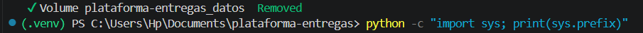

* **Captura de /entregas/estado/ en su navegador.**

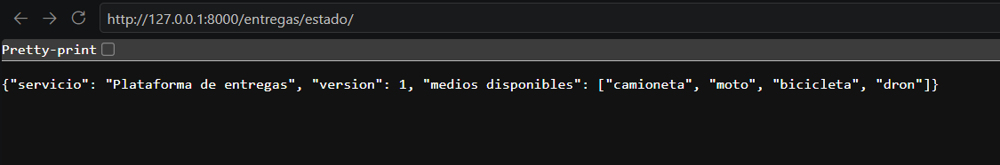

# Reto 2 — Una cotización que entrega datos #

* **Código de reglas.py y de la vista**

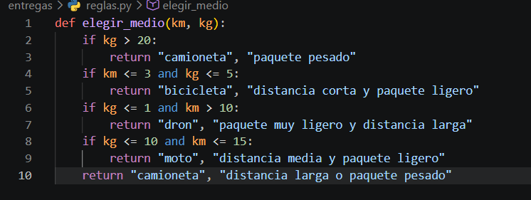

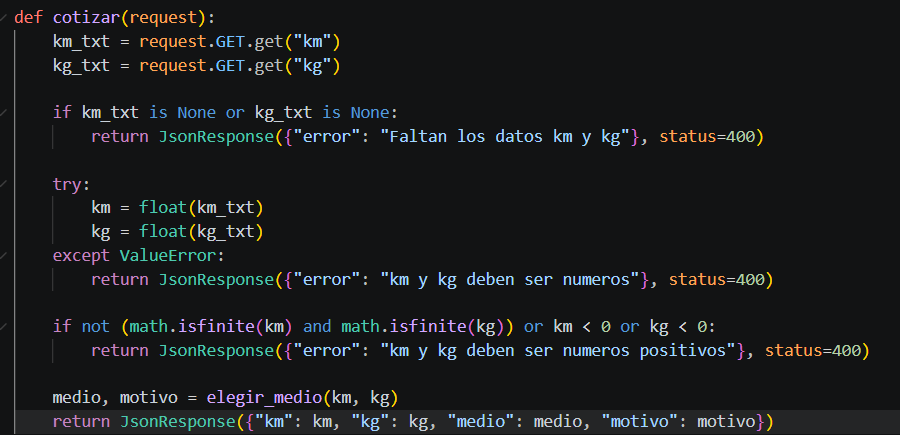

* **salida de tres pruebas: una correcta, una sin km y una con km=abc**

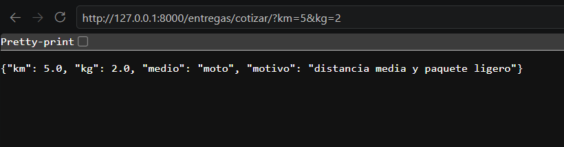

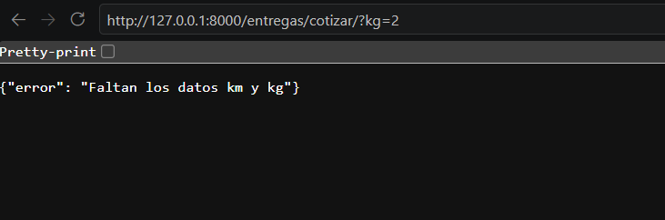

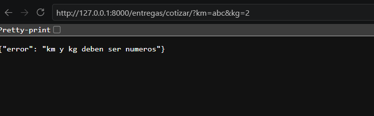

1. **¿Por qué la validación tiene que estar en el backend, aunque la app móvil ya revise que el campo no esté vacío?
Su función probablemente tiene una cadena de if.**
El backend es la única parte que se controla. La app móvil puede ser modificada, estar desactualizada, o alguien puede llamar la dirección directo con curl o Postman. Todo lo que llega de afuera no es confiable. 

2. **¿Qué patrón de los apuntes la reemplazaría cuando haya que agregar el dron o un quinto medio, y qué ganarían con eso?**
La cadena de if se reemplaza con Strategy, una clase por medio con su propia regla. Agregar el dron o un quinto medio es crear una clase nueva sin tocar el código existente (principio abierto/cerrado).

# Reto 3 — Dos clientes, un solo backend #

* **Captura de la página web y la salida del programa de Python antes de cambiar la regla.**

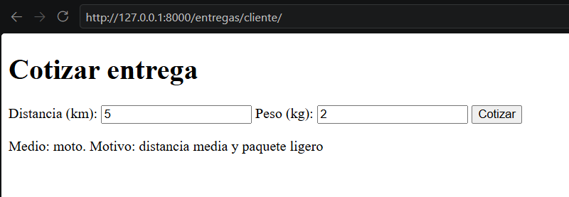

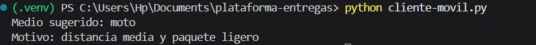

* **Despues de cambiar la regla (límite de la bicicleta  km <= 6).**

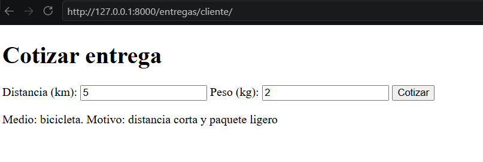

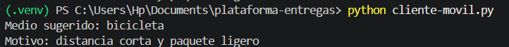

* **Si la regla hubiera estado en el JavaScript de la página, ¿qué habría pasado con el cliente de Python al cambiarla?**
Si la regla estuviera en el JavaScript, el cliente de Python (y cualquier otro) seguiría con la regla vieja o tendría que reimplementarla. Las reglas quedarían duplicadas y podrían contradecirse.

# Reto 4 — Réplicas: hacerlo fallar y arreglarlo *

* **Salida de seis peticiones a /entregas/visitas/ y seis a /entregas/visitas-mal/** 

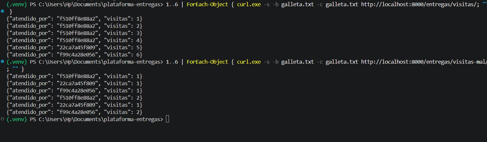

* **Agreguen una vista /entregas/ultimo/?folio=ABC123 que guarde el último folio consultado en una variable global y otra vista /entregas/ultimo/ver/ que lo muestre. Con las tres copias corriendo, consulten un folio y luego pidan verlo varias veces.**

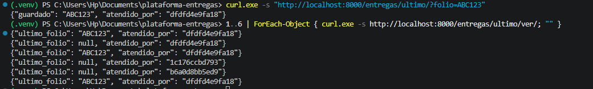

El folio se guardó en la memoria de un solo proceso. Al pedirlo varias veces, el balanceador repartió las peticiones entre las copias: solo las que atendió el proceso que guardó el folio devolvieron ABC123, y las demás devolvieron null. Cada copia tiene su propia variable global, y no se comparten entre sí.

* **Arréglenlo para que funcione con cualquier número de copias, sin usar variables globales. Pueden guardar el folio en la sesión o en un modelo de la base de datos.**

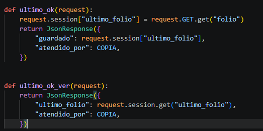

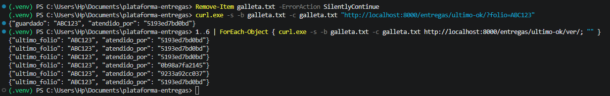

* **Suban a cinco copias con --scale y comprueben que su arreglo sigue funcionando.**

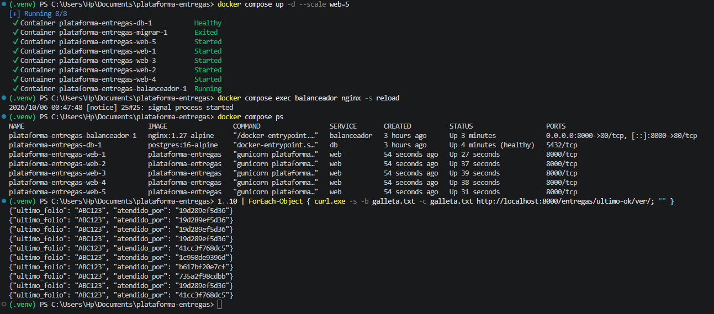

Guardamos el folio en request.session. Django guarda la sesión en la base de datos PostgreSQL, que es compartida por todas las copias, no en la memoria de cada proceso. Por eso, sin importar qué copia atienda la petición, el folio se recupera con la cookie de sesión. Al subir a cinco copias con --scale web=5 el resultado fue el mismo: atendido_por mostró cinco copias distintas y ultimo_folio siempre fue ABC123.

# Reto 5 — Casos para pensar, sin código #

1. **La app móvil ya está instalada en miles de teléfonos y lee el campo "medios_disponibles". Un integrante propone cambiarle el nombre a "medios" porque es más corto. ¿Qué le responderían y cómo harían el cambio sin romper la app?** Romperías las apps ya instaladas, porque no se actualizan al mismo tiempo. Mantén medios_disponibles, agrega medios en paralelo, y retira el viejo solo cuando casi nadie use la versión antigua (o versiona la API: version: 2).

2. **La empresa quiere enviar a cada repartidor un mensaje a las 7:00 con sus entregas del día. El código se agrega en Django y la plataforma corre con cinco copias. ¿Qué va a pasar y dónde debería ir ese trabajo?** Las cinco copias ejecutarían el trabajo y cada repartidor recibiría cinco mensajes. Debe ir en un proceso aparte (un trabajador programado o cron, con una sola instancia), no dentro de las copias web.

3. **Un cliente sube la foto de su paquete y la aplicación la guarda en la carpeta fotos/ del contenedor. A veces la foto aparece y a veces no. Expliquen por qué.** Esa carpeta vive en el sistema de archivos de un contenedor. La foto queda en la copia que atendió la subida y las demás no la ven (además se pierde si el contenedor se reinicia). Solución: almacenamiento compartido, como un volumen común o un servicio de objetos tipo S3.

4. **Alguien del equipo dice: «Ya tenemos Docker, así que podemos borrar el entorno virtual y programar directamente con =docker compose up=». ¿Están de acuerdo? ¿Para qué sirve cada uno en el trabajo diario?** No del todo. El entorno virtual sirve para programar rápido (editor, autocompletado, depurador, recarga automática). Docker sirve para probar que funciona igual en cualquier máquina y para simular réplicas y servicios (PostgreSQL, nginx). Se usan los dos.

5. **Con tres copias detrás del balanceador, una persona toca dos veces seguidas el botón de «Pagar» en la app. ¿Qué podría salir mal y qué tema de los apuntes lo resuelve?** Dos peticiones pueden llegar a copias distintas y cobrar dos veces. Se resuelve con idempotencia (un identificador único por operación que el backend reconoce y no repite). Busca en tus apuntes el tema correspondiente.